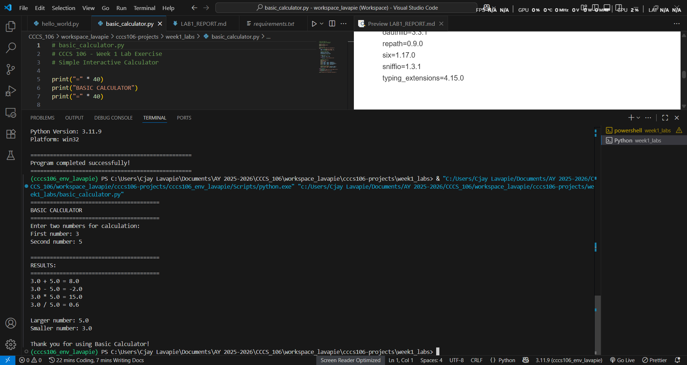

# Lab 1 Report: Environment Setup and Python Basics

**Student Name:** C-jay Lavapie
**Student ID:** 221001254
**Section:** B
**Date:** September 3, 2025

## Environment Setup

### Python Installation
- **Python Version:** Python 3.11.9
- **Installation Issues:** None
- **Virtual Environment Created:** ✅ cccs106_env_lavapie

### VS Code Configuration
- **VS Code Version:** 1.103.2
- **Python Extension:** ✅ Installed and configured
- **Interpreter:** ✅ Set to C:/Users/Cjay Lavapie/Documents/AY 2025-2026/CCCS_106/workspace_lavapie/cccs106-projects/cccs106_env_lavapie/Scripts/python.exe

### Package Installation
- **Flet Version:** 0.28.3
- **Other Packages:** anyio=4.10.0
certifi=2025.8.3
h11=0.16.0
httpcore=1.0.9
httpx=0.28.1
idna=3.10
oauthlib=3.3.1
repath=0.9.0
six=1.17.0
sniffio=1.3.1
typing_extensions=4.15.0

## Programs Created

### 1. hello_world.py
- **Status:** ✅ Completed
- **Features:** Student info display, age calculation, system info
- **Notes:** None

### 2. basic_calculator.py
- **Status:** ✅ Completed
- **Features:** Basic arithmetic, error handling, min/max calculation
- **Notes:** None

## Challenges and Solutions

None

## Learning Outcomes

About Workspaces and Requirements.txt, its a new thing that I have found out

## Screenshots

